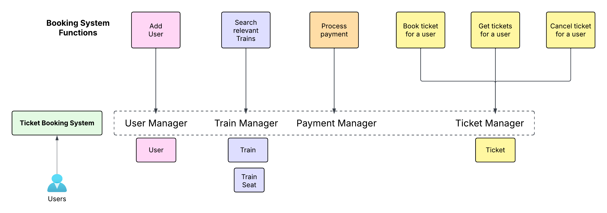
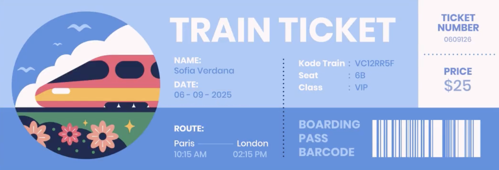

# Design Ticket Booking System

## User Flow Diagram


## Requirements

1. Users should be able to search for trains going from origin to destination at a particular time.
   For simplicity we assume all the trains run on all weekdays.
2. User should be able to book a particular train for any number of seats.
3. Users can choose between different train seat classes - Standard, Deluxe, etc.
4. User should be able to view all upcoming and previous bookings.
5. User should be able to cancel a booking if it is before 3 days of departure.

### Use Cases

- User can signup on the booking system.
- User can search for trains based on origin, destination, and time.
- User can do the payment and book tickets for a particular train.
- User can view all bookings.
- User can cancel booking if it is 3 days before the departure.

## Procedure

### 1. Write down System Functions

Based on the user flow diagram, our system needs to have the following functions:


In this step, we identify the key functions our system needs to implement based on the user flow. Each user action requires a corresponding system function to handle it. This approach helps us ensure that we're covering all the functionality needed to support the user flow, and it gives us a clear picture of what our system needs to do.

### 2. Segregate the Functions into Different Managers

Now we'll organize these functions into logical managers based on their responsibilities:


### 3. Create a Main Manager to Manage All the Managers

The main manager (TicketBookingSystem) will coordinate between all other managers. The user interacts with the TicketBookingSystem, which then delegates tasks to the appropriate managers. This creates a clean separation of concerns and makes the system more maintainable.

Also, something to notice - Since UserManager class will be managing users we also need to create User class. Similarly for TicketManager and TrainManager. Do not worry about how TrainSeat class came into picture. You can skip it for now. We will introduce it later when we need that class.



### 4. Start Writing Code

#### User Manager

Let's start implementing our system, beginning with the simplest class 'UserManager'.

```
class UserManager:
    def __init__(self):
        # {user_id: User}
        self.users = {}
        self.user_counter = 1

    def add_user(self, name: str, email: str, phone: str) -> None:
        user = User(self.user_counter, name, email, phone)
        self.users[self.user_counter] = user
        self.user_counter += 1
        print(f"User {name} has been added successfully. User ID: {user.user_id}\n")

class User:
    def __init__(self, user_id: int, name: str, email: str, phone: str):
        self.user_id = user_id
        self.name = name
        self.email = email
        self.phone = phone
```

#### Train Manager

Now, let's try implementing TrainManager.  The main idea is to implement the methods we planned earlier (i.e. search_trains). So, for that we create a dictionary of trains from which we will search. But in order to search trains we first need to add trains in that dictionary. Now how do we do it? Well, we need to add another method 'add_train' for that. This method will simply initialize a new train and then add it to the 'trains' dictionary.

**Something to observe**: We created a new method 'add_train' only when we needed it. We never created a method beforehand. And that is the mentality one should have to write code clearly and complete the problem in an interview setting.

```
class Train:
    def init(
        self,
        train_id: int,
        train_name: str,
        schedule: dict[str : (int, datetime.time)]
    ):
        self.train_id: int = train_id
        self.train_name: int = train_name
        # schedule: {location: (distance, time)}
        self.schedule: dict[str : (int, datetime.time)] = schedule
        self.origin: str = list(schedule.keys())[0]
        self.destination: str = list(schedule.keys())[-1]

class TrainManager:
    def __init__(self):
        self.trains: dict[int:Train] = {}

    def add_train(
        self,
        train_id: int,
        train_name: str,
        schedule: dict[str : (int, datetime.time)]
    ):
        train = Train(train_id, train_name, schedule)
        self.trains[train_id] = train
        print(f"Train {train_name} with ID {train_id} has been added successfully.\n")

    # Go through all the trains and return the trains
    # that have both origin and destination stops in their schedule
    # and the destination stop is after the origin stop
    def search_trains(self, origin: str, destination: str):
        trains = []
        for train in self.trains.values():
            if (
                origin in train.schedule
                and destination in train.schedule
                and train.schedule[origin][0] < train.schedule[destination][0]
            ):
                trains.append(train)
        return trains
```
#### Payment Manager

Now, we can move on to implement 'PaymentManager'. Since, it is a big design for an interview setting and the focus is not on payments we can have a very simplified version for it. We will simply return True for all the cases.

Note: If the interviewer is interested in payments then only go ahead and implement it.

```
class PaymentManager:
    def process_payment(self, user_id: int, amount: float) -> bool:
        # For simplicity, we are assuming that the payment is successful
        print(f"Payment of {amount} processed for user {user_id}")
        return True
```

#### Ticket Manager

It's time now to implement 'TicketManager'. Since this class manages tickets we first need to implement Ticket class. Now, think of an actual ticket in your hand. What does that consist of? Train Id, Origin, Destination, Date of Journey, etc.



So, that's what we fill in this class.

```
class Ticket:
    def __init__(
        self,
        ticket_id: int,
        user_id: int,
        train_id: int,
        origin: str,
        destination: str,
        date_of_journey: datetime.date,
    ):
        self.ticket_id: int = ticket_id
        self.user_id: int = user_id
        self.train_id: int = train_id
        self.origin: str = origin
        self.destination: str = destination
        self.date_of_journey: datetime.date = date_of_journey
        self.ticket_status: str = "CONFIRMED"
```

