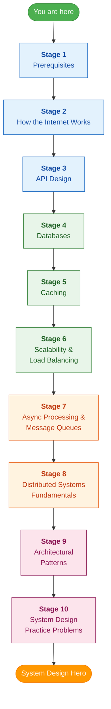

# System Design: 0 to Hero Roadmap

A structured, beginner-friendly roadmap to go from **zero knowledge** to **confidently designing large-scale systems**. Follow the stages in order — each one builds on the previous.

---

## The Roadmap

> **Colour legend:** Blue = Foundations | Green = Data Layer | Orange = Communication & Distribution | Pink = Architecture & Practice

---

## Stage 1 — Prerequisites

Before diving into system design, make sure you're comfortable with the basics.

| Topic | Resource |
|---|---|
| How computers work (CPU, RAM, Disk, OS basics) | [Crash Course Computer Science (YouTube playlist)](https://www.youtube.com/playlist?list=PL8dPuuaLjXtNlUrzyH5r6jN9ulIgZBpdo) |
| Pick one language well (Python / Java / Go) | [Python — Automate the Boring Stuff](https://automatetheboringstuff.com/) |
| Basic Data Structures & Algorithms | [NeetCode Roadmap](https://neetcode.io/roadmap) |
| Operating System fundamentals | [Operating Systems: Three Easy Pieces (free book)](https://pages.cs.wisc.edu/~remzi/OSTEP/) |

---

## Stage 2 — How the Internet Works

Understanding networking is the backbone of every system design discussion.

| Topic | Resource |
|---|---|
| How the internet works (overview) | [cs.fyi — How Does the Internet Work?](https://cs.fyi/guide/how-does-internet-work) |
| IP Addresses & DNS | [Cloudflare — What Is DNS?](https://www.cloudflare.com/learning/dns/what-is-dns/) |
| HTTP / HTTPS in depth | [MDN — An Overview of HTTP](https://developer.mozilla.org/en-US/docs/Web/HTTP/Overview) |
| TCP vs UDP | [ByteByteGo — TCP vs UDP (YouTube)](https://www.youtube.com/watch?v=ddM9AcreVqY) |
| OSI Model (quick overview) | [Cloudflare — What Is the OSI Model?](https://www.cloudflare.com/learning/ddos/glossary/open-systems-interconnection-model-osi/) |
| Proxies (Forward & Reverse) | [Cloudflare — What Is a Reverse Proxy?](https://www.cloudflare.com/learning/cdn/glossary/reverse-proxy/) |

---

## Stage 3 — API Design

APIs are how systems talk to each other. Learn to design and consume them.

| Topic | Resource |
|---|---|
| What is an API? (beginner intro) | [freeCodeCamp — What Is an API? (YouTube)](https://www.youtube.com/watch?v=GZvSYJDk-us) |
| REST API fundamentals | [REST API Tutorial](https://restfulapi.net/) |
| REST vs GraphQL | [ByteByteGo — REST vs GraphQL (YouTube)](https://www.youtube.com/watch?v=yWzKJPw_VzM) |
| WebSockets explained | [web.dev — WebSocket API](https://developer.mozilla.org/en-US/docs/Web/API/WebSockets_API) |
| API Gateway concept | [NGINX — What Is an API Gateway?](https://www.nginx.com/learn/api-gateway/) |
| Rate Limiting & Throttling | [Stripe — Rate Limiters (blog)](https://stripe.com/blog/rate-limiters) |
| Idempotency in APIs | [Stripe — Idempotency (blog)](https://stripe.com/blog/idempotency) |

---

## Stage 4 — Databases

Arguably the most important piece of any system. Take your time here.

| Topic | Resource |
|---|---|
| Relational databases explained | [Khan Academy — Intro to SQL](https://www.khanacademy.org/computing/computer-programming/sql) |
| SQL vs NoSQL | [ByteByteGo — SQL vs NoSQL (YouTube)](https://www.youtube.com/watch?v=Q_9cFgzZr8Q) |
| ACID Transactions | [MongoDB — What Are ACID Transactions?](https://www.mongodb.com/resources/basics/databases/acid-transactions) |
| Database Indexing | [Use the Index, Luke (free online book)](https://use-the-index-luke.com/) |
| Database Normalization | [Guru99 — Database Normalization](https://www.guru99.com/database-normalization.html) |
| When to use NoSQL | [Martin Fowler — NoSQL Distilled (talk)](https://www.youtube.com/watch?v=qI_g07C_Q5I) |
| Database types overview (KV, Document, Column, Graph) | [ByteByteGo — 8 Data Structures That Power Your Databases (YouTube)](https://www.youtube.com/watch?v=W_v05d_2RTo) |

---

## Stage 5 — Caching

Caching is the single most impactful technique for improving performance.

| Topic | Resource |
|---|---|
| Caching overview (what, why, where) | [ByteByteGo — Caching (YouTube)](https://www.youtube.com/watch?v=dGAgxozNWFE) |
| Cache strategies (write-through, write-back, write-around) | [codeahoy — Caching Strategies](https://codeahoy.com/2017/08/11/caching-strategies-and-how-to-choose-the-right-one/) |
| Cache eviction policies (LRU, LFU, FIFO) | [InterviewCake — LRU Cache](https://www.interviewcake.com/concept/java/lru-cache) |
| Redis crash course | [TechWorld with Nana — Redis (YouTube)](https://www.youtube.com/watch?v=OqCK95AS-YE) |
| CDN explained | [Cloudflare — What Is a CDN?](https://www.cloudflare.com/learning/cdn/what-is-a-cdn/) |

---

## Stage 6 — Scalability & Load Balancing

This is where you learn to handle millions of users.

| Topic | Resource |
|---|---|
| Scalability 101 (vertical vs horizontal) | [Gaurav Sen — System Design Basics: Horizontal vs Vertical Scaling (YouTube)](https://www.youtube.com/watch?v=xpDnVSmNFX0) |
| Load Balancer fundamentals | [NGINX — What Is Load Balancing?](https://www.nginx.com/resources/glossary/load-balancing/) |
| Load balancing algorithms | [Cloudflare — Types of Load Balancing Algorithms](https://www.cloudflare.com/learning/performance/types-of-load-balancing-algorithms/) |
| Database Sharding | [ByteByteGo — Database Sharding (YouTube)](https://www.youtube.com/watch?v=hdxdhCpgYo8) |
| Database Replication | [ByteByteGo — Master-Slave vs Master-Master Replication (YouTube)](https://www.youtube.com/watch?v=bI8Ry6GhMSE) |
| Consistent Hashing | [Gaurav Sen — Consistent Hashing (YouTube)](https://www.youtube.com/watch?v=zaRkONvyGr8) |

---

## Stage 7 — Async Processing & Message Queues

Not every request needs an immediate response. Learn asynchronous patterns.

| Topic | Resource |
|---|---|
| Message Queues explained | [AWS — What Is a Message Queue?](https://aws.amazon.com/message-queue/) |
| Pub/Sub vs Message Queue | [ByteByteGo — Pub/Sub vs Message Queue (YouTube)](https://www.youtube.com/watch?v=npilKaSYYBc) |
| Apache Kafka crash course | [Confluent — Apache Kafka 101 (free course)](https://developer.confluent.io/courses/apache-kafka/events/) |
| RabbitMQ for beginners | [CloudAMQP — RabbitMQ for Beginners](https://www.cloudamqp.com/blog/part1-rabbitmq-for-beginners-what-is-rabbitmq.html) |
| Event-Driven Architecture | [Martin Fowler — Event-Driven (article)](https://martinfowler.com/articles/201701-event-driven.html) |

---

## Stage 8 — Distributed Systems Fundamentals

The hardest but most rewarding area. Take it slow.

| Topic | Resource |
|---|---|
| CAP Theorem explained simply | [ByteByteGo — CAP Theorem (YouTube)](https://www.youtube.com/watch?v=BHqjEjzAicY) |
| Consistency models (strong, eventual, causal) | [Jepsen — Consistency Models](https://jepsen.io/consistency) |
| Consensus algorithms (Raft intro) | [The Secret Lives of Data — Raft Visualization](http://thesecretlivesofdata.com/raft/) |
| Distributed Locking | [Martin Kleppmann — How to Do Distributed Locking](https://martin.kleppmann.com/2016/02/08/how-to-do-distributed-locking.html) |
| Heartbeats & Failure Detection | [Gaurav Sen — Heartbeat in Distributed Systems (YouTube)](https://www.youtube.com/watch?v=lsKbBbXg7EQ) |
| Bloom Filters | [ByteByteGo — Bloom Filters (YouTube)](https://www.youtube.com/watch?v=V3pzxngeLqw) |
| System Design Tradeoffs (latency vs throughput, availability vs consistency) | [Donnemartin — System Design Primer: Tradeoffs](https://github.com/donnemartin/system-design-primer#trade-offs) |

---

## Stage 9 — Architectural Patterns

Learn the common blueprints used to structure real-world systems.

| Topic | Resource |
|---|---|
| Monolith vs Microservices | [ByteByteGo — Monolith vs Microservices (YouTube)](https://www.youtube.com/watch?v=m32JcRO2QLo) |
| Microservices patterns (saga, sidecar, BFF) | [microservices.io — Patterns](https://microservices.io/patterns/index.html) |
| Service Discovery | [NGINX — Service Discovery in a Microservices Architecture](https://www.nginx.com/blog/service-discovery-in-a-microservices-architecture/) |
| Circuit Breaker pattern | [Martin Fowler — Circuit Breaker](https://martinfowler.com/bliki/CircuitBreaker.html) |
| Serverless basics | [AWS — What Is Serverless?](https://aws.amazon.com/serverless/) |
| Event Sourcing & CQRS | [Martin Fowler — Event Sourcing](https://martinfowler.com/eaaDev/EventSourcing.html) |

---

## Stage 10 — System Design Practice Problems

Time to put it all together. Work through these in increasing difficulty.

### Beginner (start here)

| Problem | Resource |
|---|---|
| Design a URL Shortener | [ByteByteGo — URL Shortener (YouTube)](https://www.youtube.com/watch?v=fMZMm_0ZhK4) |
| Design a Rate Limiter | [ByteByteGo — Rate Limiter (YouTube)](https://www.youtube.com/watch?v=FU4WlwfS3G0) |
| Design a Key-Value Store | [Gaurav Sen — Key Value Store (YouTube)](https://www.youtube.com/watch?v=rnZmdmlR-2M) |
| Design a Parking Lot | [Parking Lot Design (this repo)](../design-problems/parking-lot-system/parkingLot.md) |

### Intermediate

| Problem | Resource |
|---|---|
| Design WhatsApp / Chat System | [Gaurav Sen — Design a Chat System (YouTube)](https://www.youtube.com/watch?v=vvhC64hQZMk) |
| Design Instagram / Photo Sharing | [ByteByteGo — Design Instagram (YouTube)](https://www.youtube.com/watch?v=VJpfO6KdyWE) |
| Design Twitter / News Feed | [ByteByteGo — Design Twitter (YouTube)](https://www.youtube.com/watch?v=wYk0xPP_P_8) |
| Design a Notification System | [ByteByteGo — Notification System (YouTube)](https://www.youtube.com/watch?v=bBTPZ9NdSk8) |
| Design an E-Commerce Platform | [Gaurav Sen — Design Amazon (YouTube)](https://www.youtube.com/watch?v=EpASu_1dUdE) |

### Advanced

| Problem | Resource |
|---|---|
| Design Uber / Ride Sharing | [Gaurav Sen — Design Uber (YouTube)](https://www.youtube.com/watch?v=umWABit-wbk) |
| Design Google Docs / Collaborative Editing | [System Design Interview — Google Docs (YouTube)](https://www.youtube.com/watch?v=2auwirNBvGg) |
| Design YouTube / Video Streaming | [ByteByteGo — Design YouTube (YouTube)](https://www.youtube.com/watch?v=jPKTo1iGQiE) |
| Design Dropbox / Cloud Storage | [Gaurav Sen — Design Dropbox (YouTube)](https://www.youtube.com/watch?v=U0xTu6E2CT8) |

---

## Recommended Comprehensive Resources

These are full courses and references that complement the roadmap above.

| Resource | Type | Link |
|---|---|---|
| System Design Primer | Free GitHub repo | [donnemartin/system-design-primer](https://github.com/donnemartin/system-design-primer) |
| ByteByteGo (Alex Xu) | YouTube channel | [ByteByteGo](https://www.youtube.com/@ByteByteGo) |
| Gaurav Sen | YouTube channel | [Gaurav Sen](https://www.youtube.com/@gaborsen) |
| Designing Data-Intensive Applications | Book | [DDIA by Martin Kleppmann](https://dataintensive.net/) |
| System Design Interview — An Insider's Guide (Vol. 1 & 2) | Book | By Alex Xu |
| NeetCode System Design | YouTube playlist | [NeetCode System Design](https://www.youtube.com/playlist?list=PLot-Xpze53le35rQuIbRET3YwEtrcJfdt) |
| roadmap.sh — System Design | Interactive roadmap | [roadmap.sh/system-design](https://roadmap.sh/system-design) |

---

## How to Use This Roadmap

1. **Go in order.** Each stage assumes you know the material from previous stages.
2. **Don't rush.** Spend at least a few days on each stage. Let concepts sink in.
3. **Take notes.** Write down key concepts in your own words after each topic.
4. **Build something.** After stages 1-6, try building a small project (e.g., a URL shortener) to solidify your understanding.
5. **Practice out loud.** For the practice problems in Stage 10, talk through your design as if you're in an interview. Draw diagrams on paper or a whiteboard tool.
6. **Revisit.** System design is iterative. Circle back to earlier stages as you learn more advanced topics — you'll understand them differently.

---

*This roadmap is a living document. Contributions and suggestions are welcome!*
